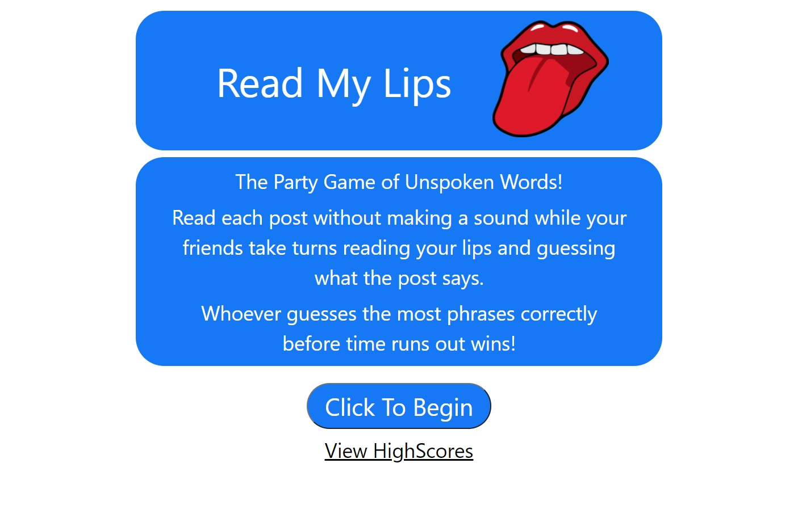

# Read-My-Lips
Read My lips is an online game for friends and Family which allows a player to guess what a person is whispering

## Purpose
To entertain and keep boredom away 

## Built With
* HTML  * 2 APIs(Giphy and Jokes)
* CSS
* JS
* Bulma
* Figma
* J Query

## Website
 https://flying-dink.github.io/Read-My-Lips/

## Screenshot   

## Contribution
The original project repo can be found here, https://github.com/Flying-dink/Read-My-Lips, this is a duplicated project created to be able to make changes without involving the contributors from my bootcamp.
Made by Flying-Dink a.k.a. Catherine Clifford , NukaGrizz a.k.a.Joe Tremols, TonyCloud a.k.a. Antonio, rppierr33 a.k.a. Ralph Pierre
